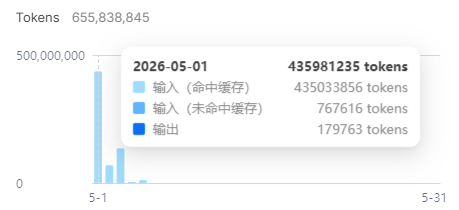

# Real-world cache hit — single user, single day

A real Railwise user shared their DeepSeek dashboard for **2026-05-01**.
Used with permission, anonymized.

## The numbers

| | Tokens |
|---|---:|
| Input — cache hit | 435,033,856 |
| Input — cache miss | 767,616 |
| Output | 179,763 |
| **Day total** | **435,981,235** |

**Cache hit ratio (input):**
`435,033,856 / (435,033,856 + 767,616)` = **99.82%**

## Cost — using the prices Railwise bills against (`src/telemetry/stats.ts`)

USD per 1M tokens — `inputCacheHit / inputCacheMiss / output`:
- `deepseek-v4-flash` — `0.0028 / 0.14 / 0.28`
- `deepseek-v4-pro` — `0.003625 / 0.435 / 0.87`

Assuming **v4-flash** (the project default):

| | This user (99.82% hit) | Same workload, **0% cache** |
|---|---:|---:|
| Cache-hit input | $1.22 | — |
| Cache-miss input | $0.11 | $61.01 |
| Output | $0.05 | $0.05 |
| **Total / day** | **$1.38** | **$61.06** |

→ Cache saved this user **$59.68**, or **~97.7%** off the un-cached baseline, on a single day.

On **v4-pro** (6.25% of uncached input cost) the same workload would cost
**~$2.07** vs **~$189.73** without cache — a **~98.9%** saving.

## "Isn't that just DeepSeek's prefix cache?"

DeepSeek's API ships prefix caching enabled by default; the *cache* is theirs,
the *hit rate* is the client's. Same API, different clients, very different
hit rates:

- DeepSeek's own web chat: 60–80% within a single conversation, drops to 0%
  on a new session (system prompt may differ).
- Cherry Studio / Open WebUI / generic OpenAI-shape SDKs: typically 30–60%
  on long sessions — history gets reordered, tool specs get re-serialized,
  every drift breaks the prefix.
- Cline / Continue and other XML-tool-call clients: lower still — every tool
  result inlines into the conversation, shifting bytes the cache keys on.

99.82% is what falls out of these four design choices in Railwise:

1. **`ImmutablePrefix`** (`src/memory.ts`) — system prompt + tool specs are
   frozen at session start. Same byte sequence every turn.
2. **`AppendOnlyLog`** — turns only append. No reorder, no edit-in-place.
3. **`VolatileScratch`** — chain-of-thought / per-turn scratch lives outside
   the cached prefix so it never poisons the next hit.
4. **Auto-compact** — when context approaches the cap, older turns fold into
   a summary message *appended* to the prefix; the prefix itself isn't
   rewritten, so the cache survives the fold.

DeepSeek gave us cacheable bytes. The four mechanisms above are how we keep
the bytes cacheable.

## Reproduce

The synthetic side of this lives in `benchmarks/tau-bench/` — same task set
run through `CacheFirstLoop` vs a deliberately cache-hostile baseline. The
real-world data above is what the synthetic numbers look like once a user
runs the harness in anger.

Submit your own dashboard screenshot if you want it anonymized and added
here — open an issue.
